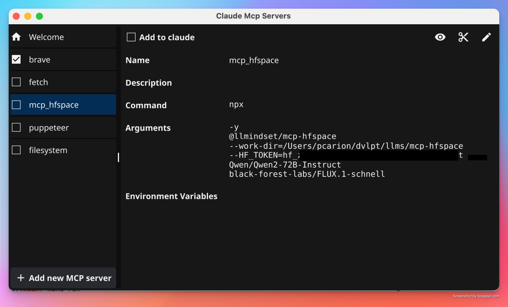
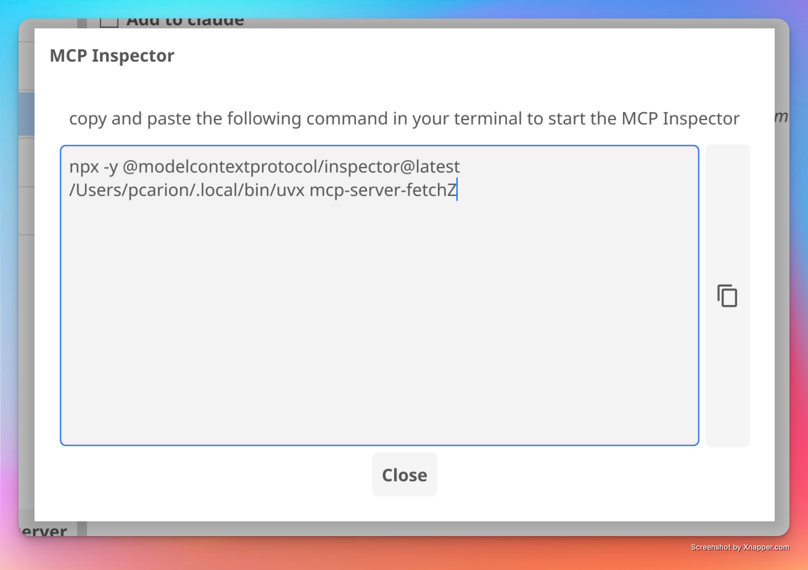

<br/>
<p align="center">

</p>
<br/>
<div align="center">
<p>

[](https://goreportcard.com/report/github.com/pcarion/cleric)
[](https://github.com/pcarion/cleric/releases/latest)
</p>
</div>


# Cleric

Cleric is a desktop application that helps you manage Model Context Protocol (MCP) servers for [Claude desktop](https://claude.ai/download). It provides an easy-to-use interface for adding, removing, and configuring your MCP servers.

Builds are available for MacOS and Windows at: https://github.com/pcarion/cleric/releases

> **Note:** The version `0.3.0` is available for Windows but has not been tested on Windows. Any feedback is welcome. The code related to starting and stopping the MCP Inspector should be looked at.

## How It Works

Cleric manages two configuration files:

1. A personal server list at `$HOME/.cleric.json`
   - Stores all your available MCP servers
   - Acts as a backup of your server configurations

2. The Claude Desktop configuration at `<OS specific path>/claude_desktop_config.json`
   - Contains the active MCP servers currently used by Claude Desktop

## Key Features

- Seamlessly switch MCP servers in and out of Claude Desktop
- Automatically preserves server configurations when making changes
- Syncs with Claude Desktop: Any servers you manually add to Claude Desktop will be automatically added to your Cleric server list on next launch
- Real-time saving: Changes are saved automatically as you make them
- Test any server by launching the MCP Inspector


## How to use

On the left side of the application, you can see the list of MCP servers that you have configured.

The servers with a checkmark are the ones that are currently configured in Claude desktop.

The right side of the application shows the information about the selected server:



The `Remove From Claude` button will remove the server from Claude desktop but the server will remain in your personal server list.

The `✄` button will remove the server from both your personal server list and the list of servers that are currently configured in Claude desktop.

The `🖊️` button will allow you to edit the server information:


The `👁️` button will show you the command to start the MCP Inspector in the terminal:



## Important Note

Before using Cleric for the first time, please back up your `claude_desktop_config.json` file if you have manually configured MCP servers in Claude Desktop.

Don't forget to restart Claude Desktop after you have made changes to the server list.


### MacOS issue when launching the app

If you get the "cannot be opened because the developer cannot be verified" error, you can apply the following workaround.

* Control-click the app icon, then choose Open from the shortcut menu.
* Click Open.

If you get the "cleric is damaged and can't be opened. You should move it to the Bin." error you can apply the following workaround.

Launch Terminal and then issue the following command: `xattr -cr /path/to/cleric.app`.

## Changelog

- `0.5.0` - 2025-01-25
   - remove capabilities to start the MCP Inspector. Instead, display the command to start the MCP Inspector in a dialog with a copy button to copy the command to the clipboard.

- `0.4.0` - 2025-01-17
   - start using light theme

- `0.3.0` - 2025-01-16
   - fix issue with MCP Inspector on Windows - the Windows version has NOT been tested yet. Any feedback is welcome.

- `0.2.0` - 2025-01-14
   - all toolbar button to start the MCP Inspector
   - add version checker on Welcome page
   - add help text when hovering over the toolbar buttons

- `0.1.0` - 2025-01-09
   - Initial release

## Coming Soon

- [ ] Add a button to open the Claude Desktop configuration file in the user's default text editor.
- [ ] Add a button to open the Cleric configuration file in the user's default text editor.

# Development

## Prerequisites

To build and run this project, you need:

- Go 1.23.4 or later
- Fyne toolkit and its dependencies - read the [Getting Started with Fyne](https://docs.fyne.io/started/) documentation for more information

## Installation

- Clone the repository:

```bash
git clone https://github.com/pcarion/cleric.git
cd cleric
```

2. Build the project:

```bash
make build
```

The built binary will be available in the `build` directory.

### Running the Application

To run the application directly:
```bash
make run
```

## Project Structure

```
.
├── cmd/
│   └── cleric/          # Main application entry point
├── internal/
│   └── ui/             # UI components and logic
│   └── config/         # Code to manage the list of MCP servers
└── build/              # Build artifacts
```

## Contributing

1. Fork the repository
2. Create your feature branch (`git checkout -b feature/amazing-feature`)
3. Commit your changes (`git commit -m 'Add some amazing feature'`)
4. Push to the branch (`git push origin feature/amazing-feature`)
5. Open a Pull Request

## License

This project is licensed under the terms found in the `LICENSE` file in the root directory.

## Version

The application version information is embedded at build time from `cmd/cleric/version.txt`.

# Documentation
* [Fyne documentation](https://docs.fyne.io/)
* [Fyne demo source code](https://github.com/fyne-io/fyne/blob/master/cmd/fyne_demo/main.go)

# Acknowledgments

This project was my introduction to the Fyne toolkit. Special thanks to Alex Ballas's [go2tv](https://github.com/alexballas/go2tv) project, which served as an excellent reference. His well-structured codebase demonstrates Fyne's capabilities beautifully and provided valuable insights for building this application.

